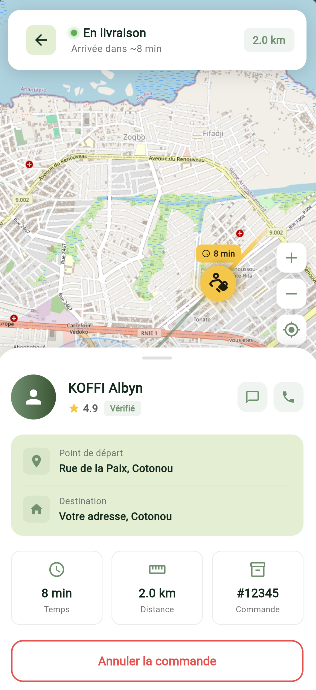

# Application Mobile de Gestion des Services

## Description

Application mobile développée avec Flutter pour la gestion des prestations de services. Cette solution permet aux utilisateurs de rechercher, réserver et gérer divers services, avec une interface utilisateur intuitive et des fonctionnalités complètes de gestion des profils et des réservations.

## Contexte

**Matière** : Développement Mobile – Flutter  
**Établissement** : École Nationale d'Économie Appliquée et de Management (ENEAM)  
**Niveau** : 3ème année AIP (Analyse et Programmation Informatique)

## Équipe de Développement

| Nom 
|------
| AKADI Madina 
| ATCHAOUE Jordy 
| GLELE Jefferson 
| OKE Meryl 
| NASCIMENTO Zachario

## Fonctionnalités Principales

### Gestion des Utilisateurs
- Inscription et authentification sécurisée
- Profil utilisateur personnalisable
- Historique des réservations
- Système de notation et d'avis

### Gestion des Services
- Consultation des services disponibles
- Recherche et filtrage des services
- Détails complets des prestataires
- Géolocalisation des prestataires à proximité

### Réservations
- Prise de rendez-vous en temps réel
- Suivi en direct des réservations
- Notifications de rappel
- Annulation et modification des réservations

### Communication
- Messagerie intégrée avec les prestataires
- Système de notation et d'avis
- Partage sur les réseaux sociaux

## Technologies Utilisées

### Frontend
- **Framework** : Flutter 3.35
- **Langage** : Dart 3.9
- **IDE** : Android Studio / VS Code
- **Gestion d'état** : Provider
- **UI Kits** : Material Design 3, Cupertino, flutter_map

### Backend
- **API** : Laravel
- **Base de données** : MySQL
- **Authentification** : JWT
- **Hébergement** : À définir

## Prérequis

- Flutter SDK (dernière version stable)
- Dart SDK
- Un émulateur Android/iOS ou un appareil physique
- Compte développeur (pour les déploiements)

## Installation

1. **Cloner le dépôt**
   ```bash
   git clone https://github.com/Jeffersonglele/FLUTTER_APP_ENEAM.git
   cd eneam_projet
   ```

2. **Installer les dépendances**
   ```bash
   flutter pub get
   ```

3. **Lancer l'application**
   ```bash
   flutter run
   ```

## Captures d'écran





